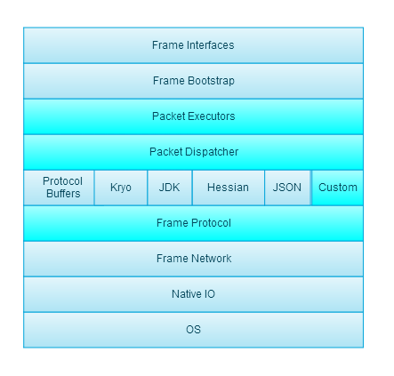

lost-rpc
========

异步跨平台的RPC实现

## 特性

> * 支持很多编码解码器（Protobuf【跨平台】、Hessian、JDK、Kryo)
> * 支持自定义Codec
> * 支持自定义Protocol
> * 实现了消息的同步分发、异步分发
> * 支持自定义消息分发
> * 服务端支持消息同步处理、全局异步处理、链接消息有序异步处理
> * 对Protobuf、Json提供默认实现

以上特性都能让你快速的架起一个RPC内部通信系统。

------

## 结构图

## 展望

> * 支持压缩算法（虽然处于对CPU消耗的考虑，还是更倾向于用PB这种schema方式来减小消息包体积，但是如果消息太大还是需要此特性）
> * 支持加密，目前如果想使用加密，可以通过自定义Codec实现，未来打算内部支持加密
> * 大家一起共建